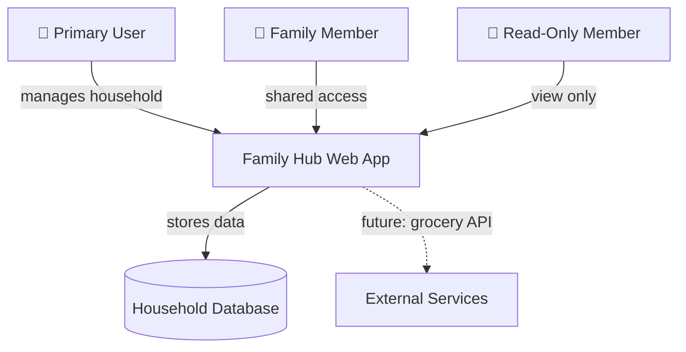
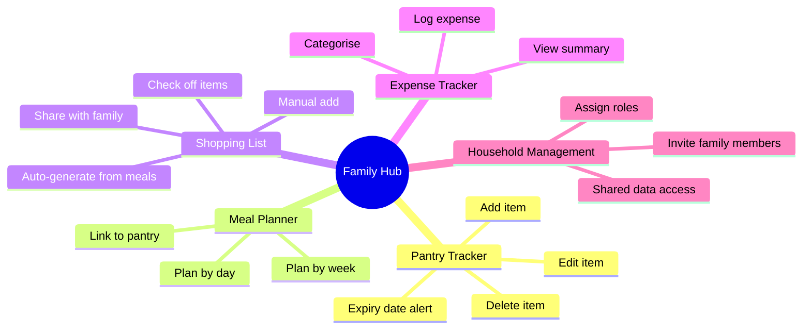
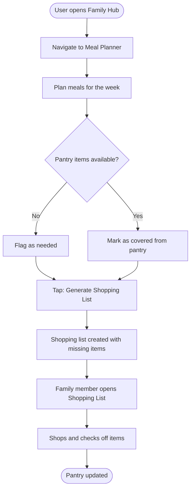
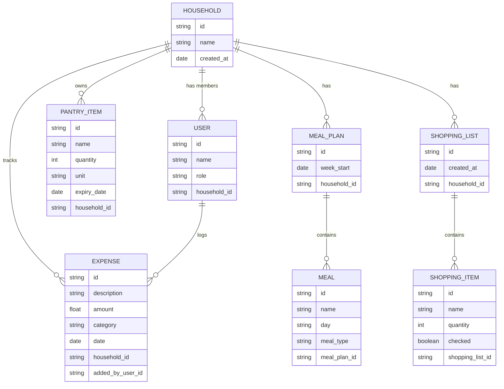
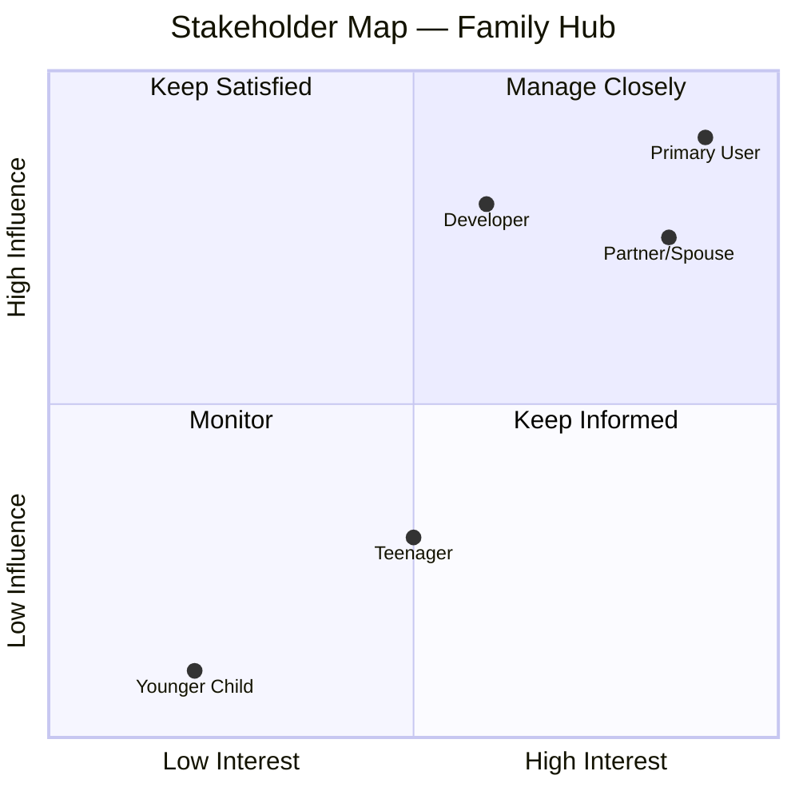
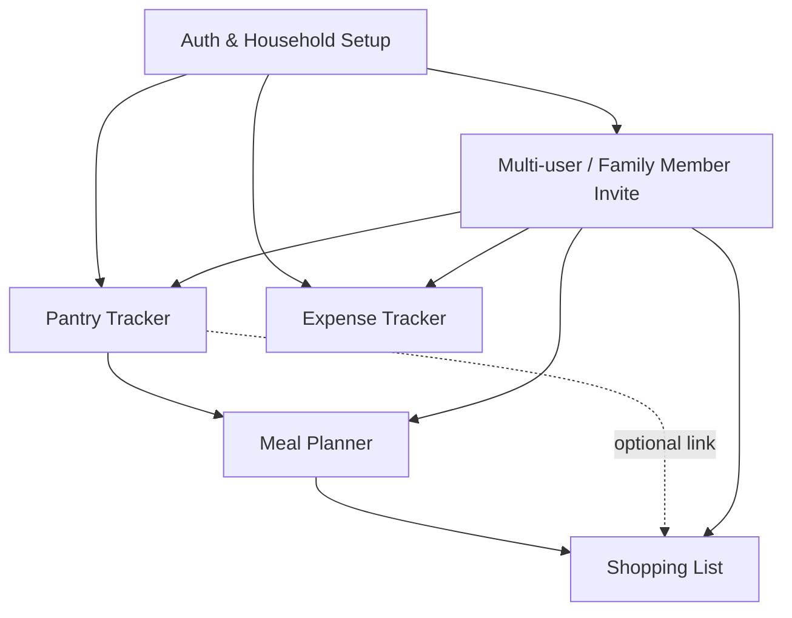

# BA Skill — Family Hub Project

## Project Context

**Product Name:** Family Hub
**Type:** Personal web application (mobile-first, runs in any phone browser)
**Domain:** Home management / family productivity
**Target Users:** Families managing day-to-day household operations

### Core Feature Areas
1. **Pantry Tracker** — track items, quantities, expiry dates
2. **Meal Planner** — plan meals per day/week, link to pantry
3. **Shopping List** — auto-generate or manually manage, shareable within family
4. **Expense Tracker** — log and categorise household spending

### Key Design Principles (always reference these)
- Mobile-first UX — designed for phone browsers, no app install required
- Simplicity over power — families need quick, low-friction interactions
- Shared access — multiple family members may use the same household data
- Offline-friendly considerations — household tasks happen away from desks

---

## How to Use This Skill

When invoked, ask the user which BA activity they need:

1. Requirements Analysis
2. User Story Creation
3. Stakeholder & User Analysis
4. Feature Scoping / Prioritisation
5. Process Mapping (As-Is / To-Be)
6. Acceptance Criteria Review
7. Open Questions & Risk Log
8. Project Specification
9. Documentation Creation
10. Diagrams
11. Implementation Breakdown & Phasing
12. Error Handling

Then follow the relevant section below.

---

## 1. Requirements Analysis

### Before you start — ask:
- Which feature area does this relate to? (Pantry / Meals / Shopping / Expenses / Cross-cutting)
- Who raised this need — a specific family role (parent, teenager, child)?
- Is this a new feature, a change to existing behaviour, or a constraint?

### Analysis Framework

**Problem Statement**
Write a 2–3 sentence statement:
> "Family members currently [problem]. This causes [impact]. Family Hub should [solution direction]."

**Requirements Table**

| ID | Feature Area | Type | Requirement Statement | Priority | Acceptance Criteria |
|----|-------------|------|-----------------------|----------|---------------------|
| REQ-001 | Pantry | Functional | The user shall be able to add a pantry item with name, quantity, and expiry date | High | Item appears in pantry list immediately; expiry date is optional |

**Requirement Types:**
- **Functional** — what the system does
- **Non-Functional** — performance, usability, accessibility, security
- **Constraint** — technical or business boundaries (e.g., must work on Safari iOS)

**Quality Rules — every requirement must pass:**
- [ ] Testable — no vague words like "fast", "easy", "user-friendly"
- [ ] Single concern — no AND in a requirement statement (split it)
- [ ] Has an acceptance criterion
- [ ] Traceable to a user need or business goal
- [ ] Scoped — clearly in or out of Family Hub v1

---

## 2. User Story Creation

### User Roles in Family Hub

| Role | Description |
|------|-------------|
| **Primary User (Admin)** | The family member who sets up the household — typically a parent |
| **Family Member** | Any household member with shared access (spouse, teenager) |
| **Read-Only Member** | A family member with view-only access (e.g., a child checking the shopping list) |

### Story Format

```
As a [Family Hub user role],
I want [specific action],
So that [tangible household benefit].
```

**Example:**
> As a Primary User,
> I want to scan a barcode to add a pantry item,
> So that I don't have to type product names manually while unpacking groceries.

### Story Checklist (INVEST)
- [ ] **Independent** — can be built and tested alone
- [ ] **Negotiable** — not a fixed contract, open to discussion
- [ ] **Valuable** — delivers value to a family member
- [ ] **Estimable** — team can size it
- [ ] **Small** — completable in one sprint
- [ ] **Testable** — clear pass/fail acceptance criteria

### Acceptance Criteria Format (Given/When/Then)

```
Given [precondition / starting state]
When [user action]
Then [expected outcome]
And [additional outcome if needed]
```

**Example:**
> Given the pantry list is open
> When the user taps "Add Item" and enters a name and quantity
> Then the item appears at the top of the pantry list
> And a success confirmation is shown

---

## 3. Stakeholder & User Analysis

### Primary Stakeholders for Family Hub

| Stakeholder | Role | Interest | Influence |
|------------|------|----------|-----------|
| Parent / Primary User | Sets up and manages the household data | High — daily user | High |
| Partner / Spouse | Shared day-to-day management | High — daily user | High |
| Teenager | Checks shopping list, adds items | Medium — occasional user | Low–Medium |
| Child (younger) | View only — may check meal plan | Low — passive consumer | Low |
| Developer / Builder | Implements the application | Delivery quality | High |

### User Empathy Questions (ask these before writing requirements)
- What is the user doing when they need this feature? (cooking, shopping, commuting?)
- What device are they on? (always assume mobile phone)
- Are they in a hurry or do they have time to navigate?
- Are multiple family members doing this at the same time?
- What happens if the internet is slow or unavailable?

---

## 4. Feature Scoping & Prioritisation

### MoSCoW Framework — applied to Family Hub

| Priority | Meaning in Family Hub context |
|----------|-------------------------------|
| **Must Have** | Core to daily household management; app is not useful without it |
| **Should Have** | Significantly improves the experience; high user value |
| **Could Have** | Nice addition; low effort, low risk |
| **Won't Have (v1)** | Out of scope for initial release |

### v1 Scope Boundaries

**In scope:**
- Pantry item management (add, edit, delete, view)
- Weekly meal planning
- Shopping list (manual + generated from meal plan)
- Household expense logging and categorisation
- Basic multi-user household sharing

**Out of scope (v1):**
- Barcode scanning (could have — v2)
- Receipt OCR / photo upload for expenses
- Nutritional information / dietary tracking
- Integration with external grocery delivery services
- Push notifications (mobile browser limitations in v1)

---

## 5. Process Mapping

### As-Is vs To-Be Template

**Feature Area:** [e.g., Shopping List Management]

| Step | As-Is (Without Family Hub) | To-Be (With Family Hub) | Improvement |
|------|---------------------------|-------------------------|-------------|
| 1 | Parent writes list on paper or WhatsApp | Opens Family Hub, views generated list | Single source of truth |
| 2 | Family member texts additions | Taps "Add item" directly | Real-time, no message chains |
| 3 | Shopper marks items off mentally | Taps checkbox in app | No missed items |

---

## 6. Acceptance Criteria Review

When reviewing acceptance criteria, check:

- [ ] Covers the happy path (normal user flow)
- [ ] Covers at least one edge case (empty state, max input, no data)
- [ ] Covers one error/failure state (network error, invalid input)
- [ ] Mobile-specific behaviour is addressed (tap targets, back button, scroll)
- [ ] Multi-user scenario considered (what if two people edit simultaneously?)
- [ ] Data persistence confirmed (does it save? when?)

---

## 7. Open Questions & Risk Log

### Open Questions Template

| # | Question | Raised By | Impact Area | Target Owner | Status |
|---|----------|-----------|-------------|--------------|--------|
| OQ-001 | Can multiple family members edit the shopping list simultaneously? | BA | Shopping List, Data | Tech Lead | Open |
| OQ-002 | Should expenses support multiple currencies? | BA | Expenses | Product Owner | Open |

### Common Risks for Family Hub

| Risk | Likelihood | Impact | Mitigation |
|------|-----------|--------|------------|
| Multi-user data conflicts (two people editing at once) | Medium | High | Define last-write-wins or conflict resolution strategy in v1 |
| Mobile browser storage limits for offline use | Medium | Medium | Scope offline feature carefully; define what persists locally |
| Scope creep into recipe management / nutrition | High | Medium | Strictly enforce v1 boundary; log as v2 backlog |
| Low adoption if onboarding is too complex | Medium | High | Design zero-friction onboarding; max 3 steps to first value |

---

## 8. Project Specification

The project specification is the single source of truth for what Family Hub is, why it exists, and what success looks like. Produce or update it whenever scope, objectives, or constraints change.

---

**1. Product Vision**
> Family Hub is a mobile-first web app that gives every family a single place to manage their home — from what's in the fridge to what they're spending.

**2. Problem Statement**
> Families today manage household tasks across WhatsApp messages, paper lists, notes apps, and spreadsheets. There is no unified, shared tool designed specifically for home management. This leads to missed shopping items, forgotten meals, and no visibility into household spending.

**3. Objectives (v1)**

| # | Objective | Measurable Outcome |
|---|-----------|-------------------|
| O1 | Reduce missed grocery items | Family completes shopping from a single shared list |
| O2 | Reduce food waste | Pantry items with expiry dates are visible before purchase |
| O3 | Enable meal planning | Family plans at least one week of meals in the app |
| O4 | Track household spending | All household expenses logged and categorised in one place |

**4. Target Users**

| User Segment | Description | Primary Need |
|-------------|-------------|--------------|
| Parent / Primary User | Manages household, sets up the app | Control, overview, ease of management |
| Partner / Spouse | Co-manages household | Quick access, easy collaboration |
| Teenager | Adds items, checks lists | Simple, fast, mobile-native feel |
| Younger Child | View only | Read the meal plan or shopping list |

**5. v1 Feature Summary**

| Feature | Description | Priority |
|---------|-------------|----------|
| Pantry Tracker | Add, view, edit, delete pantry items with quantity and expiry | Must Have |
| Meal Planner | Plan meals by day/week, link to pantry inventory | Must Have |
| Shopping List | Manual + auto-generated from meal plan; shareable | Must Have |
| Expense Tracker | Log and categorise household expenses | Must Have |
| Multi-user Household | Shared access for family members with role-based permissions | Must Have |

**6. Non-Functional Requirements**

| ID | Category | Requirement |
|----|----------|-------------|
| NFR-001 | Compatibility | Must work on Safari iOS 15+, Chrome Android 90+ |
| NFR-002 | Performance | Pages must load in under 3 seconds on a 4G connection |
| NFR-003 | Usability | All primary actions reachable within 2 taps from home screen |
| NFR-004 | Accessibility | Minimum WCAG 2.1 AA compliance |
| NFR-005 | Security | Household data is private; no data shared between households |
| NFR-006 | Responsiveness | Fully functional on screens 375px wide and above |

**7. Assumptions**
- Users have a smartphone with a modern browser
- Households are self-managed (no admin portal needed)
- English language only for v1
- No native app install — PWA or web-only is acceptable to users

**8. Constraints**
- No app store deployment for v1
- No third-party grocery API integration
- No payment processing required
- Single household per account in v1

**9. Success Metrics**

| Metric | Target |
|--------|--------|
| User onboards and creates first pantry item | Within 5 minutes of first login |
| Shopping list generated from meal plan | Used by at least one family member per week |
| Expenses logged | At least weekly by Primary User |
| Retention | Family returns to app at least 3x per week |

**10. Definition of Done (Project Level)**
- All v1 features built, tested, and deployed
- Non-functional requirements verified
- At least one real family has used the app for 2 weeks
- No critical or high severity bugs open

---

## 9. Documentation Creation

When asked to create documentation, identify the document type and follow the appropriate template.

**A. Business Requirements Document (BRD)**
Structure:
1. Executive Summary
2. Project Background & Problem Statement
3. Stakeholder List
4. Scope (In / Out)
5. Functional Requirements (full table)
6. Non-Functional Requirements
7. Assumptions & Constraints
8. Open Questions
9. Sign-off Section

**B. Functional Specification**
Structure:
1. Feature Overview
2. User Roles Affected
3. User Stories with Acceptance Criteria
4. Business Rules
5. Data Requirements
6. Error Handling
7. Edge Cases

**C. Release Notes / Change Log**
```
## Family Hub — v[X.X] Release Notes
**Release Date:** [date]

### New Features
- [Feature name]: [one-line description]

### Changes
- [What changed and why]

### Bug Fixes
- [Issue description and fix]

### Known Issues
- [Any outstanding issues with workaround if available]
```

**D. Meeting / Workshop Notes**
```
## [Meeting Title] — [Date]
**Attendees:** [names and roles]
**Facilitator:** [name]

### Agenda Items Covered
1. [topic] — [summary of discussion]

### Decisions Made
- [Decision 1] — Owner: [name]

### Actions
| Action | Owner | Due Date |
|--------|-------|----------|
| [action] | [name] | [date] |

### Open Items Carried Forward
- [item]
```

### Documentation Standards
- All documents use plain English — no jargon without a glossary entry
- Every requirement, story, or decision has a unique ID
- Dates use DD-MMM-YYYY format (e.g., 01-Jun-2026)
- Every document has a version number and change history table
- Owner is always named — no ownerless decisions or actions

---

## 10. Diagrams

When asked to create a diagram, produce it in **Mermaid syntax** so it renders directly in markdown, VS Code, and GitHub.

### A. System Context Diagram



### B. Feature Map



### C. User Flow Diagram

**Example — Shopping List Generation from Meal Plan:**



### D. Entity Relationship Diagram (ERD)



### E. Stakeholder Map



### Diagram Instructions
- Always use Mermaid unless the user requests another format
- After producing a diagram, ask: "Would you like to add, remove, or adjust any element?"
- For ERDs, align the data model to current v1 scope — do not add speculative future entities
- For user flows, always include an error/failure path, not just the happy path
- Label all diagram nodes clearly

---

## 11. Implementation Breakdown & Phasing

Family Hub v1 is built incrementally. When asked to break down a feature or the full product into implementation steps, follow this section.

### Before you start — ask:
- Which feature are we breaking down? (or is this a full v1 plan?)
- Are there existing parts already built? If so, what is done?
- What is the team size and rough sprint cadence?

Apply the **dependency-first rule**: you cannot build what depends on something that doesn't exist yet. Always map dependencies before sequencing.

### Dependency Map



**Rule:** Auth and Household Setup must be Phase 1. Everything else depends on a household existing.

---

### Phase 1 — Foundation

| # | Task | Why First | Output |
|---|------|-----------|--------|
| 1.1 | Project scaffolding — repo, folder structure, tech stack setup | Nothing else can start | Working local dev environment |
| 1.2 | User authentication — register, login, logout | All features require a logged-in user | Auth flow working |
| 1.3 | Household creation — create household on first login | All data is scoped to a household | Household record linked to user |
| 1.4 | Basic navigation shell — bottom nav with 4 feature tabs | Required before any feature screen | App shell renders on mobile |
| 1.5 | Data persistence layer — database schema, basic CRUD setup | All features read/write data | DB connected, base tables created |

**Definition of Done:**
- [ ] User can register, log in, and log out
- [ ] Household is created and linked to user on first login
- [ ] App shell renders correctly on iPhone Safari and Android Chrome
- [ ] Database is connected and base schema is in place

---

### Phase 2 — Pantry Tracker

Build pantry first — Meal Planner and Shopping List both reference pantry data.

| # | Task | Notes |
|---|------|-------|
| 2.1 | Pantry list screen — view all items | Empty state required |
| 2.2 | Add pantry item — name, quantity, unit, expiry date (optional) | Expiry is optional |
| 2.3 | Edit pantry item | Inline edit or edit screen |
| 2.4 | Delete pantry item | Confirm before delete |
| 2.5 | Expiry date visual indicator — highlight items expiring within 3 days | Warn, don't auto-delete |

**Definition of Done:**
- [ ] User can add, view, edit, and delete pantry items
- [ ] Expiry date is optional but visible when set
- [ ] Items expiring within 3 days are visually flagged
- [ ] Empty state shown when pantry has no items

---

### Phase 3 — Meal Planner

Depends on Phase 2.

| # | Task | Notes |
|---|------|-------|
| 3.1 | Weekly meal plan view — 7 days, 3 meal slots per day | Breakfast / Lunch / Dinner |
| 3.2 | Add meal to a day/slot | Free text in v1 |
| 3.3 | Edit / remove meal from plan | Simple update |
| 3.4 | Link meal to pantry items | Optional; helps shopping list generation |
| 3.5 | Navigate between weeks | Default = current week |

**Definition of Done:**
- [ ] User can plan all meals for a week
- [ ] Meals can be linked to pantry items
- [ ] Week navigation works
- [ ] Empty days show a clear empty state

---

### Phase 4 — Shopping List

Depends on Phase 3.

| # | Task | Notes |
|---|------|-------|
| 4.1 | Shopping list view — all items, checked/unchecked | Group by category if possible |
| 4.2 | Manually add item | Name + quantity |
| 4.3 | Generate list from meal plan — items not already in pantry | Core automation feature |
| 4.4 | Check off item while shopping | Persist checked state |
| 4.5 | Clear checked items after shopping trip | User decides when done |

**Definition of Done:**
- [ ] User can manually add and check off items
- [ ] Auto-generation only includes items not already in pantry
- [ ] Checked state persists if user leaves and returns
- [ ] List can be cleared after shopping

---

### Phase 5 — Expense Tracker

Independent — can run in parallel with Phase 3 or 4.

| # | Task | Notes |
|---|------|-------|
| 5.1 | Expense log view — newest first | Date, description, amount, category |
| 5.2 | Add expense — description, amount, category, date | Date defaults to today |
| 5.3 | Edit / delete expense | Confirm on delete |
| 5.4 | Expense categories — predefined list | Groceries, Utilities, Transport, Dining, Household, Other |
| 5.5 | Monthly summary — total spend by category | Simple totals, no charts in v1 |

**Definition of Done:**
- [ ] User can log, edit, and delete expenses
- [ ] Categories selectable from a fixed list
- [ ] Monthly total per category is visible
- [ ] Empty state shown when no expenses logged

---

### Phase 6 — Multi-user / Family Member Sharing

Depends on Phases 1–5 being stable.

| # | Task | Notes |
|---|------|-------|
| 6.1 | Invite family member via link or code | Simple invite mechanism |
| 6.2 | Join household — accept invite, link account | New user joins existing household |
| 6.3 | Role assignment — Primary / Family Member / Read-Only | Enforced at data access level |
| 6.4 | Shared data visibility | Real-time or near real-time |
| 6.5 | Remove family member | Primary User only; does not delete historical data |

**Definition of Done:**
- [ ] Primary User can invite others via link or code
- [ ] Invited user can join and immediately see household data
- [ ] Role permissions are enforced
- [ ] Primary User can remove a member

---

### Implementation Task Template

| Task ID | Phase | Feature | Task Description | Depends On | Effort | Priority |
|---------|-------|---------|-----------------|------------|--------|----------|
| T-001 | 1 | Foundation | Set up project repo and folder structure | — | S | Must Have |
| T-002 | 1 | Auth | Implement user registration and login | T-001 | M | Must Have |

**Effort sizing:**
- **S** — less than half a day
- **M** — half a day to 2 days
- **L** — 2–5 days (consider splitting)
- **XL** — must be broken down further before development starts

### Prioritisation Rules

When two tasks compete, apply in order:
1. **Dependency first** — unblock other tasks before adding features
2. **User-facing value** — prefer what a family member will notice immediately
3. **Risk reduction** — build the hardest / most uncertain things early
4. **Stability before features** — a reliable Phase 1 is worth more than a half-built Phase 3

---

## 12. Error Handling

Error handling must be specified as part of requirements and acceptance criteria — not left to the developer to decide.

### Principles

1. **Always tell the user what happened** — no silent failures
2. **Always tell the user what to do next** — don't leave them stuck
3. **Never lose user data** — if a save fails, the form stays populated
4. **Mobile-first error design** — short, plain language; no technical jargon
5. **Recover gracefully** — offer retry; never force the user back to the home screen

---

### A. Network / Connectivity Errors

| Scenario | User Message | Behaviour |
|----------|-------------|-----------|
| No internet when saving | "No connection. Your item has been saved locally and will sync when you're back online." | Queue locally; sync on reconnect |
| No internet when loading | "You're offline. Showing your last saved data." | Show cached data; no empty state |
| Request times out | "This is taking longer than expected. Please try again." | Show retry button; don't navigate away |

### B. Validation Errors

| Scenario | User Message | Behaviour |
|----------|-------------|-----------|
| Required field empty | "Please enter a [field name]." | Highlight field; block submit |
| Expiry date in the past | "This date has already passed. Are you sure?" | Warn but allow |
| Non-numeric amount | "Please enter a number for the amount." | Inline message below field |
| Duplicate pantry item | "You already have [item] in your pantry. Update the quantity instead?" | Offer merge option |

### C. Permission Errors

| Scenario | User Message | Behaviour |
|----------|-------------|-----------|
| Read-Only tries to edit | "You have view-only access. Ask your household admin to make changes." | Block action; explain why |
| Invalid invite link | "This invite link has expired. Ask your household admin to send a new one." | Clear message; no data exposed |
| Non-member accesses data | Redirect to login / join screen | No data visible |

### D. Data Errors

| Scenario | User Message | Behaviour |
|----------|-------------|-----------|
| Item fails to save | "We couldn't save your item. Please try again." | Keep form populated; show retry |
| Item fails to delete | "We couldn't delete this item. Please try again." | Keep item in list; show inline error |
| Shopping list generation — nothing missing | "Your pantry already has everything for this week's meals." | Positive confirmation, not an error |
| Expense amount is zero | "Are you sure the amount is £0?" | Warn but allow |

### E. Empty States

Every list view must have a designed empty state — these are not errors.

| Screen | Message | Action |
|--------|---------|--------|
| Pantry | "Your pantry is empty. Add your first item to get started." | "Add Item" button |
| Meal Planner | "No meals planned this week. Start planning to generate your shopping list." | "Add Meal" button |
| Shopping List | "Your shopping list is empty. Add items or generate from your meal plan." | "Add Item" / "Generate" |
| Expense Log | "No expenses logged yet. Tap below to add your first one." | "Add Expense" button |

---

### Error Handling Checklist (per feature)

- [ ] All required fields have inline validation with a human-readable message
- [ ] All network failure states handled (no internet, timeout, server error)
- [ ] Empty state designed and implemented for every list view
- [ ] Permission errors show a clear explanation, not a generic "access denied"
- [ ] No action silently fails — every failure produces visible feedback
- [ ] Save failures keep the form populated — no data loss on error
- [ ] Error messages use plain family-friendly language — no HTTP codes, no stack traces
- [ ] Retry offered wherever a network action fails

---

### Error Handling in Acceptance Criteria

Every user story must include at least one error scenario:

```
Given [error condition]
When [user attempts action]
Then [error message is shown]
And [form/data remains intact]
And [user is offered a next step]
```

**Example:**
> Given the user has no internet connection
> When they tap "Add Pantry Item"
> Then the item is saved locally with a "Pending sync" indicator
> And a banner reads "You're offline — changes will sync when you reconnect"
> And the item appears in the pantry list immediately

---

## Output Standards

All BA outputs for Family Hub should:
- Use plain language accessible to non-technical family stakeholders
- Reference specific Family Hub feature areas (Pantry / Meals / Shopping / Expenses)
- Specify which user role is affected
- Flag any assumption explicitly — never embed assumptions silently
- Note any mobile-specific behaviour or constraint
- Link back to a business value (saves time, reduces waste, reduces friction)
