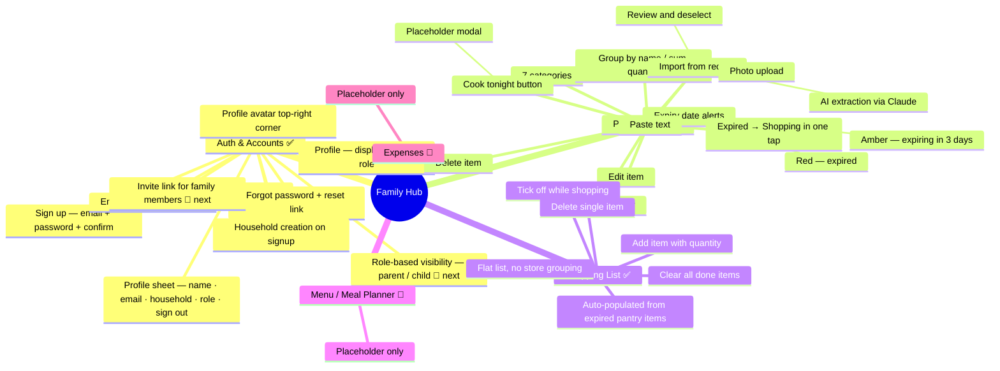
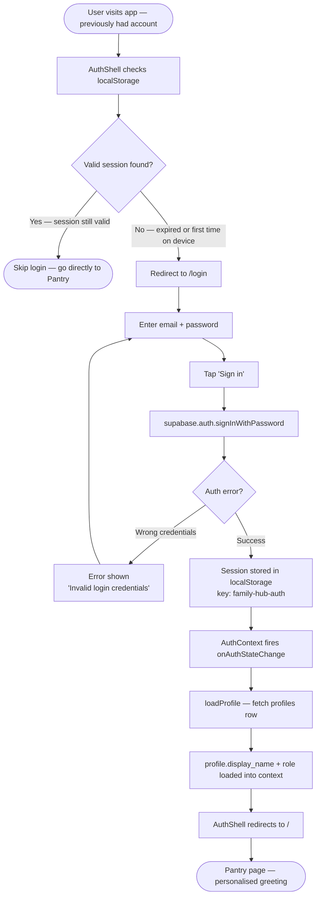
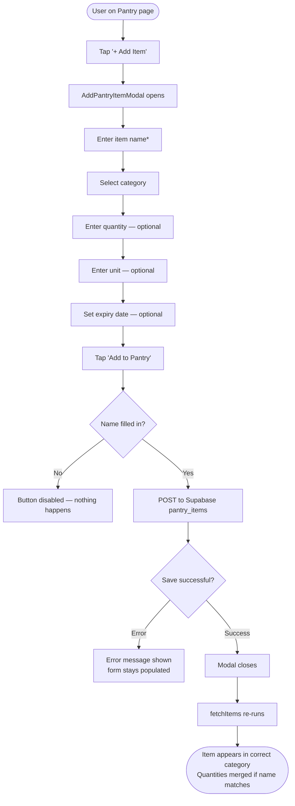
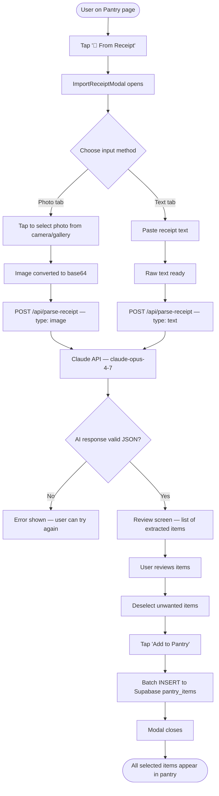
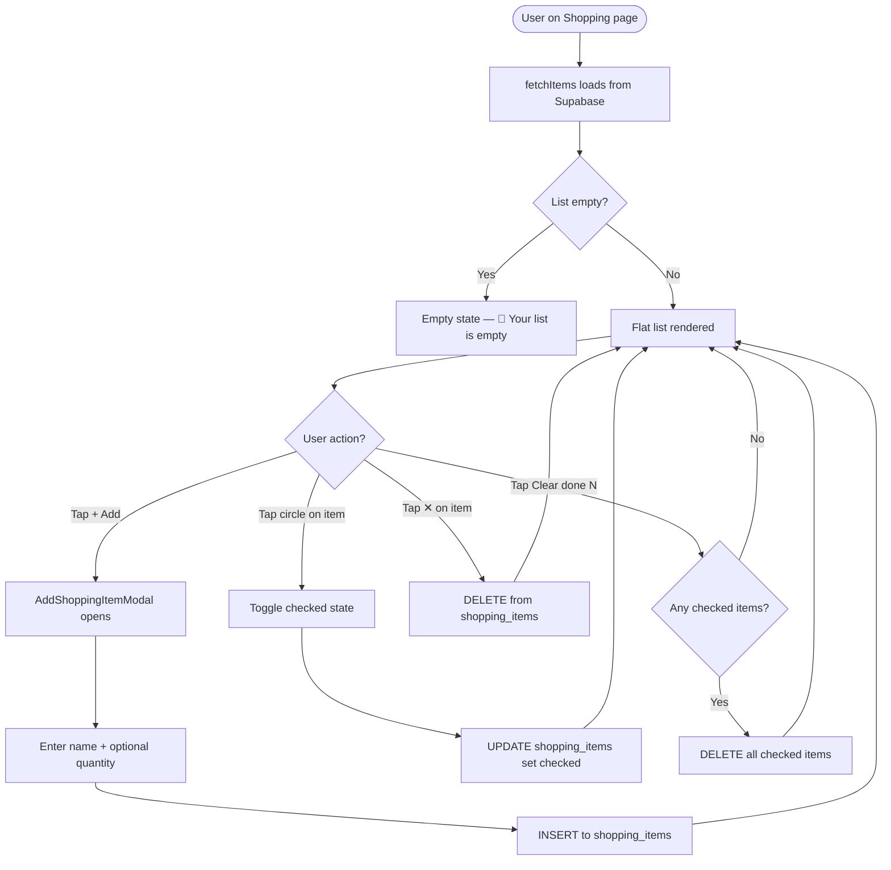
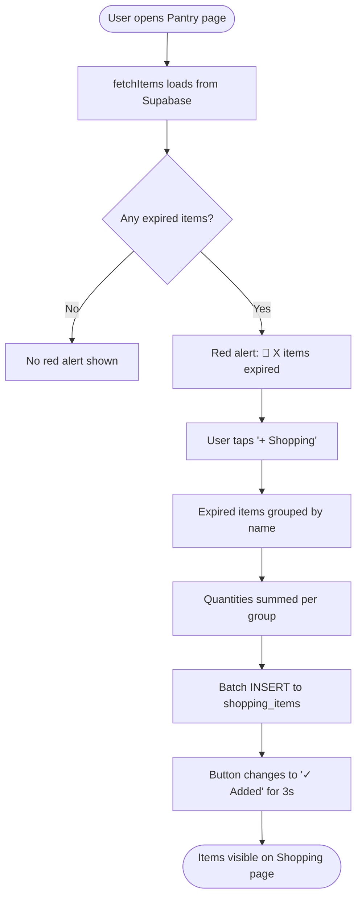
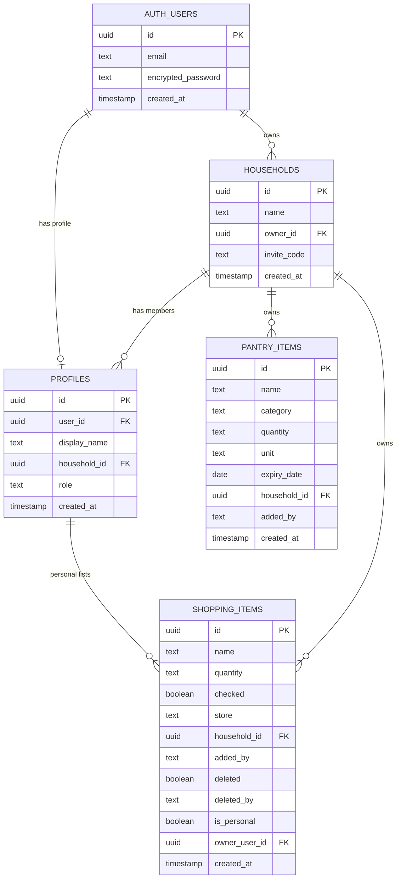
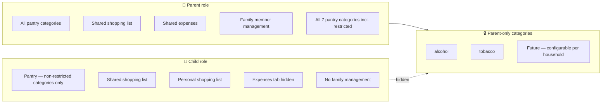
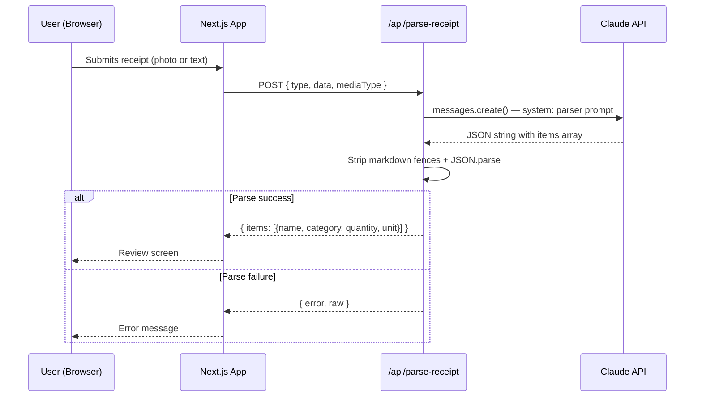
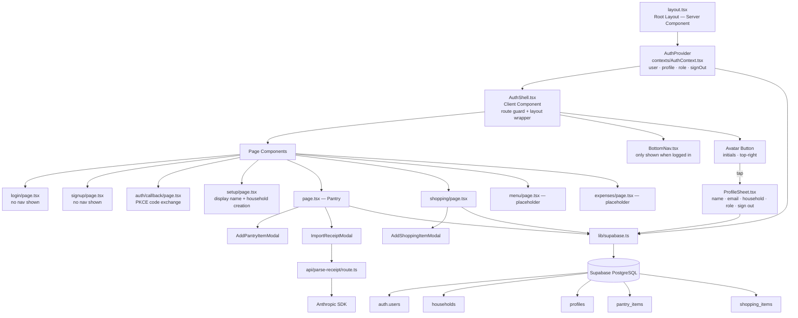

# Family Hub — Diagrams

**Version:** 1.4
**Date:** 07-Jun-2026
**Render:** All diagrams use Mermaid syntax — renders in VS Code (Markdown Preview), GitHub, and Notion.

---

## 1. Feature Map — What Is Built



---

## 2. System Context Diagram

Shows how Family Hub sits within its broader ecosystem: who uses it and what external systems it communicates with.

```mermaid
graph TD
    PA["👤 Parent / Admin<br/>(Primary User)"]
    FM["👤 Family Member<br/>(Child / Partner)"]

    subgraph FH ["Family Hub Web App (Next.js)"]
        UI[Client UI<br/>React · Tailwind]
        API[API Routes<br/>Next.js Route Handlers]
    end

    subgraph SUPABASE ["Supabase (Backend-as-a-Service)"]
        AUTH[Supabase Auth<br/>email + password sessions<br/>JWT tokens · localStorage]
        DB[(Supabase PostgreSQL<br/>households · profiles<br/>pantry_items · shopping_items)]
    end

    EMAIL["📧 Email Provider<br/>(Supabase-managed SMTP)<br/>confirmation links · reset links"]
    CLAUDE["🤖 Anthropic Claude API<br/>claude-opus-4-7<br/>receipt parsing"]

    PA -->|uses app in browser| UI
    FM -->|uses app in browser| UI
    UI -->|auth calls| AUTH
    UI -->|data queries / mutations via Supabase JS SDK| DB
    AUTH -->|sends| EMAIL
    EMAIL -->|email confirmation / reset link| PA
    EMAIL -->|email confirmation / reset link| FM
    API -->|messages.create| CLAUDE
    UI -->|POST /api/parse-receipt| API
    AUTH -->|RLS: auth.uid() checks| DB
```

---

## 3. App Navigation Structure (with Auth)

```mermaid
flowchart TD
    ROOT[Browser opens app]
    ROOT --> LAYOUT[Root Layout<br/>layout.tsx]
    LAYOUT --> AUTH_PROVIDER[AuthProvider<br/>contexts/AuthContext.tsx<br/>holds user + profile + role]
    AUTH_PROVIDER --> AUTH_SHELL[AuthShell<br/>components/AuthShell.tsx<br/>route guard + layout]

    AUTH_SHELL --> AUTH_CHECK{User logged in?}

    AUTH_CHECK -->|No| LOGIN[/login<br/>Email + Password form]
    LOGIN -->|No account?| SIGNUP[/signup<br/>Email + Password<br/>Sends confirmation email]
    SIGNUP -->|Email confirmed| CALLBACK[/auth/callback<br/>Exchanges PKCE code for session]
    CALLBACK --> SETUP[/setup<br/>Enter display name + household name<br/>Creates household + profile]
    SETUP -->|Success| AUTH_CHECK
    LOGIN -->|Success| AUTH_CHECK

    AUTH_CHECK -->|Yes| NAV[Bottom Navigation Bar<br/>4 tabs visible]
    AUTH_CHECK -->|Yes| MAIN[Main content area]

    NAV -->|Tab 1 🏠| PANTRY[Pantry Page /]
    NAV -->|Tab 2 🛒| SHOPPING[Shopping Page /shopping]
    NAV -->|Tab 3 🍽️| MENU[Menu Page /menu — placeholder]
    NAV -->|Tab 4 💰| EXPENSES[Expenses Page /expenses — placeholder]

    PANTRY -->|tap + Add Item| MODAL_ADD[AddPantryItemModal]
    PANTRY -->|tap ✏️ on item| MODAL_EDIT[AddPantryItemModal — edit mode]
    PANTRY -->|tap 🧾 From Receipt| MODAL_RECEIPT[ImportReceiptModal]
    SHOPPING -->|tap + Add| MODAL_SHOP[AddShoppingItemModal]
```

---

## 3. User Flow — Sign Up (Create Household)

```mermaid
flowchart TD
    A([User opens app for first time]) --> B[AuthShell detects no session]
    B --> C[Redirect to /login]
    C --> D[User taps 'Create an account']
    D --> E[/signup page loads]

    E --> F[Enter email]
    F --> G[Enter password — min 6 chars + confirm]
    G --> H[Tap 'Create account']

    H --> I[supabase.auth.signUp with emailRedirectTo=/auth/callback]
    I --> J{Auth error?}
    J -->|Yes — email taken etc.| K[Error shown<br/>form stays populated]
    J -->|No session yet| L['Check your email' screen shown<br/>link to /login]

    L --> M([User opens confirmation email])
    M --> N[/auth/callback — supabase.auth.exchangeCodeForSession]
    N --> O[Session created — onAuthStateChange fires]
    O --> P[AuthShell: user exists but no profile → redirect to /setup]

    P --> Q[/setup page — enter your name]
    Q --> R[Enter display name — required]
    R --> S[Enter household name — optional]
    S --> T[Tap 'Create my household']

    T --> U[INSERT into households<br/>name = household name or default<br/>owner_id = auth.uid()]
    U --> V{Household created?}
    V -->|Error| W[Error shown — user can retry]
    V -->|Success| X[INSERT into profiles<br/>user_id, display_name, household_id, role = 'parent']

    X --> Y{Profile created?}
    Y -->|Error 23505 — already exists| Z[applyProfile from form data<br/>treat as success]
    Y -->|Other error| AA[Error shown]
    Y -->|Success| Z
    Z --> AB[applyProfile → React state updated]
    AB --> AC[AuthShell detects profile → redirect to /]
    AC --> AD([Pantry page])
```

---

## 4. User Flow — Sign In



---

## 5. User Flow — Child Joins via Invite Link

```mermaid
flowchart TD
    A([Parent generates invite]) --> B[Invite link created:<br/>/join?code=a3f9bc12&role=child]
    B --> C[Parent shares link via WhatsApp / message]

    C --> D([Child opens link on their phone])
    D --> E[/join page reads code + role from URL]
    E --> F[Look up household by invite_code<br/>SELECT from households WHERE invite_code = code]

    F --> G{Valid code?}
    G -->|No — expired or wrong| H[Error: 'This invite link is not valid.<br/>Ask your parent for a new one.']
    G -->|Yes| I[Show signup form<br/>pre-filled role = child<br/>household name shown for context]

    I --> J[Child enters their name]
    J --> K[Child enters email]
    K --> L[Child enters password]
    L --> M[Tap 'Join Family Hub']

    M --> N[supabase.auth.signUp]
    N --> O{Success?}
    O -->|Error| P[Error shown]
    O -->|Yes| Q[INSERT into profiles<br/>user_id, display_name<br/>household_id = from invite code<br/>role = 'child']

    Q --> R[AuthContext loads — role = child]
    R --> S([Child lands on Pantry<br/>Restricted categories hidden])
```

---

## 6. User Flow — Add Pantry Item



---

## 7. User Flow — Import from Receipt



---

## 8. User Flow — Shopping List



---

## 9. User Flow — Expired Items to Shopping List



---

## 10. Entity Relationship Diagram (target schema — auth phase)



---

## 11. Role-Based Visibility



---

## 12. AI Integration — Receipt Parsing



---

## 13. Component Architecture (with Auth)


