# Family Hub — Diagrams

**Version:** 1.5
**Date:** 09-Jun-2026
**Render:** All diagrams use Mermaid syntax — renders in VS Code (Markdown Preview), GitHub, and Notion.

---

## 1. Feature Map — What Is Built

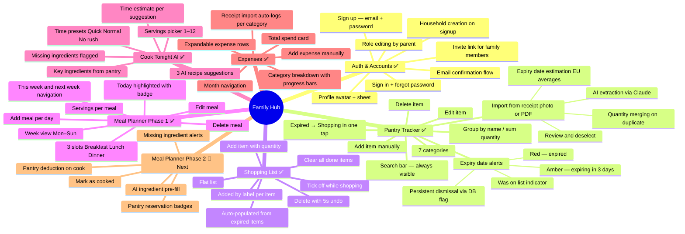

---

## 2. System Context Diagram

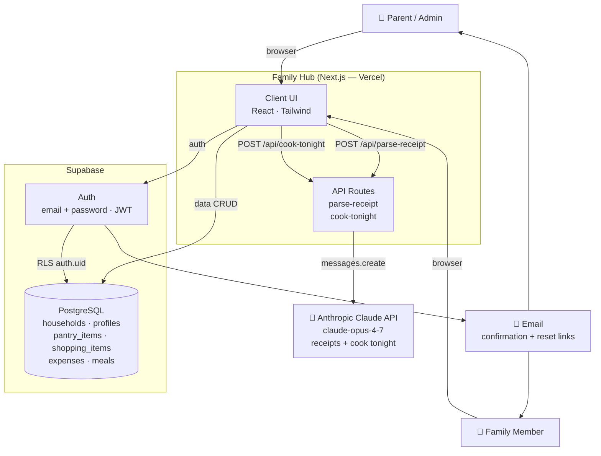

---

## 3. App Navigation Structure

```mermaid
flowchart TD
    ROOT[Browser opens app]
    ROOT --> AUTH_CHECK{Logged in?}

    AUTH_CHECK -->|No| LOGIN[/login]
    LOGIN --> SIGNUP[/signup]
    SIGNUP --> CALLBACK[/auth/callback — PKCE]
    CALLBACK --> SETUP[/setup — name + household]
    SETUP --> AUTH_CHECK

    AUTH_CHECK -->|Yes, no profile| SETUP
    AUTH_CHECK -->|Yes, has profile| TABS

    TABS --> T1[🏠 Pantry /]
    TABS --> T2[🛒 Shopping /shopping]
    TABS --> T3[🍽️ Menu /menu]
    TABS --> T4[💰 Expenses /expenses]

    T1 -->|+ Add Item| M1[AddPantryItemModal]
    T1 -->|✏️ edit| M1
    T1 -->|🧾 From Receipt| M2[ImportReceiptModal]
    T1 -->|🍽️ Cook Tonight| M3[CookTonightModal]
    T2 -->|+ Add| M4[AddShoppingItemModal]
    T3 -->|+ Add on any day| M5[AddMealModal]
    T3 -->|✏️ edit meal| M5
    T4 -->|+ Add Expense| M6[AddExpenseModal]
```

---

## 4. User Flow — Expiry Alert Lifecycle

This is one of the more complex flows — it covers how the expiry alert appears, gets dismissed, and how the pantry displays the item afterwards.

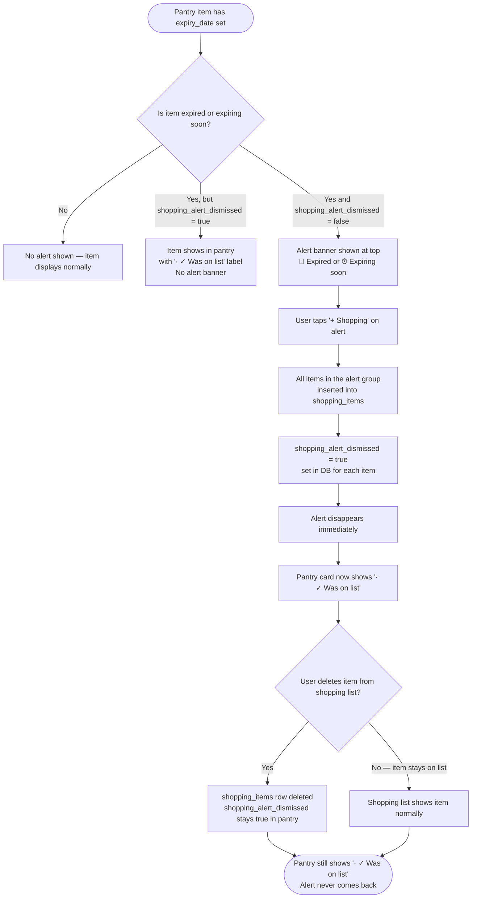

---

## 5. User Flow — Receipt Import (with Expiry Estimation & Quantity Merging)

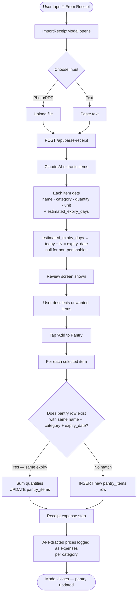

---

## 6. User Flow — Cook Tonight AI

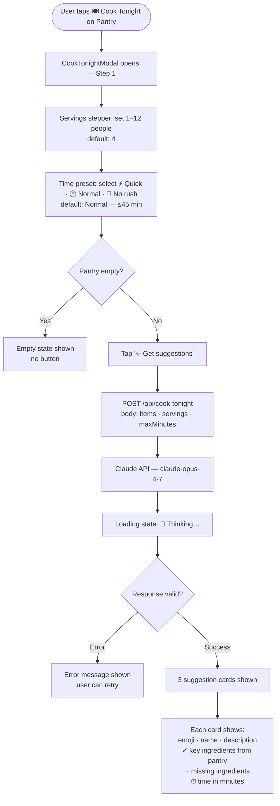

---

## 7. User Flow — Meal Planner

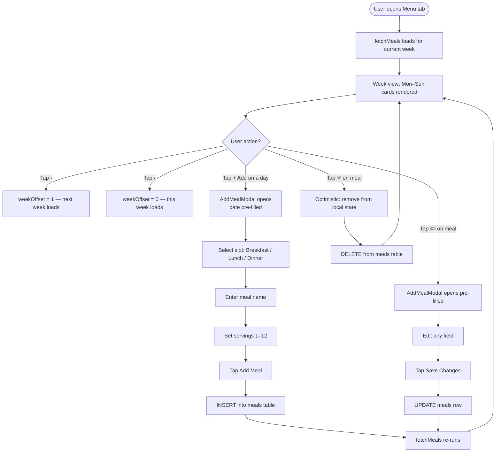

---

## 8. User Flow — Sign Up (Create Household)

```mermaid
flowchart TD
    A([User opens app]) --> B[AuthShell: no session]
    B --> C[/login]
    C --> D[Tap 'Create an account']
    D --> E[/signup — enter email + password]
    E --> F[supabase.auth.signUp]
    F --> G['Check your email' screen]
    G --> H([User confirms email])
    H --> I[/auth/callback — PKCE exchange]
    I --> J[Session created]
    J --> K[AuthShell: no profile → /setup]
    K --> L[Enter display name + household name]
    L --> M[INSERT households + profiles]
    M --> N([Pantry page — role = parent])
```

---

## 9. User Flow — Shopping List Delete with Undo

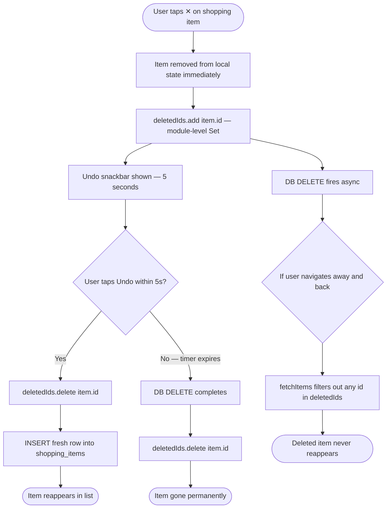

---

## 10. Entity Relationship Diagram (current schema)

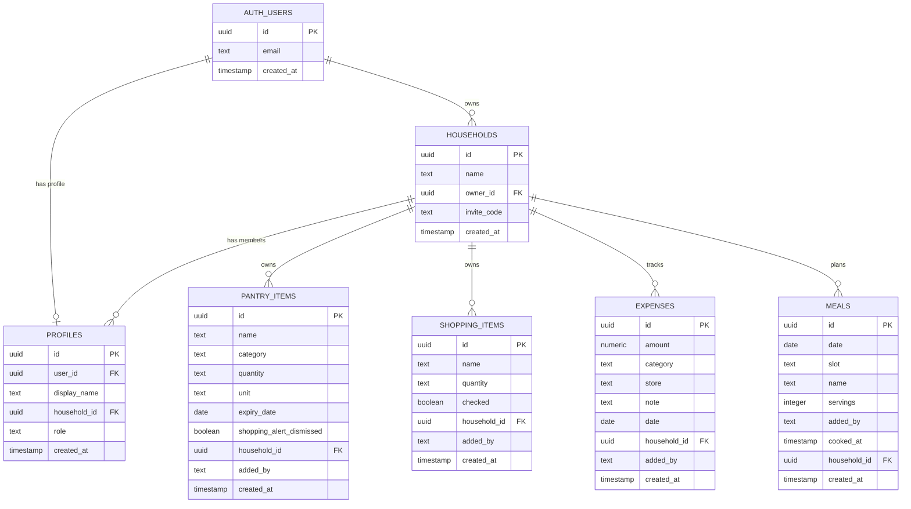

---

## 11. Component Architecture (current)

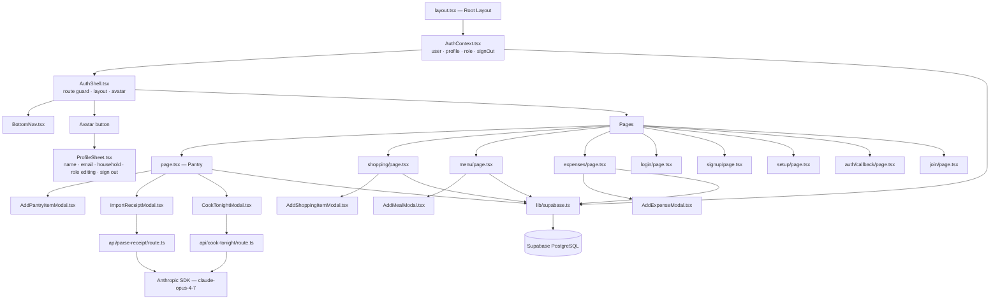

---

## 12. AI Integration — Receipt Parsing

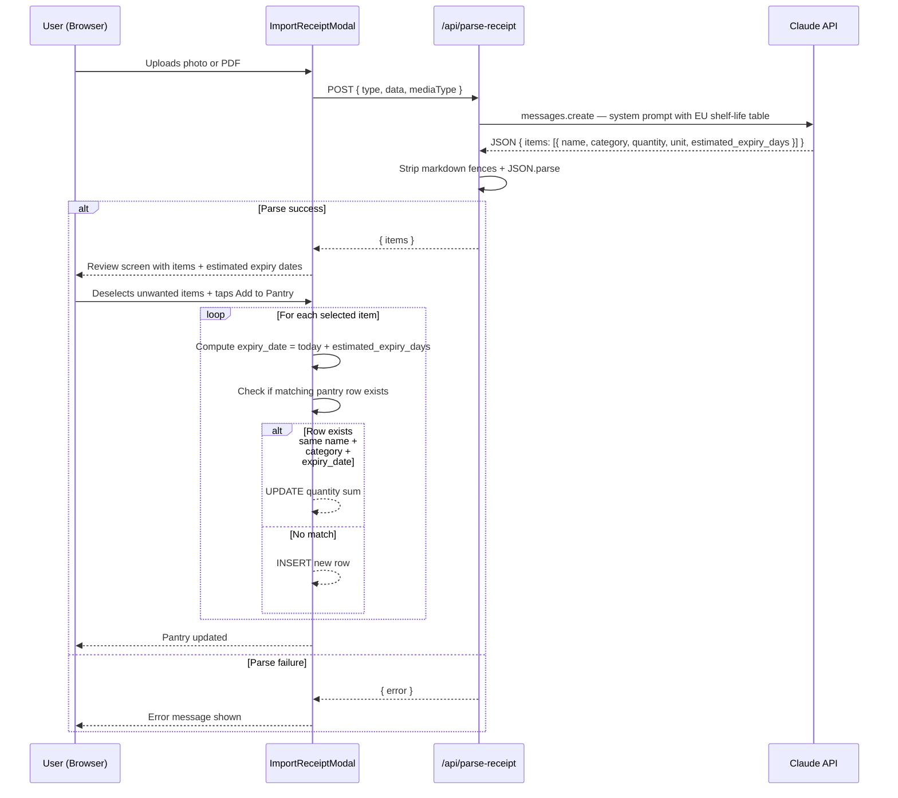

---

## 13. AI Integration — Cook Tonight

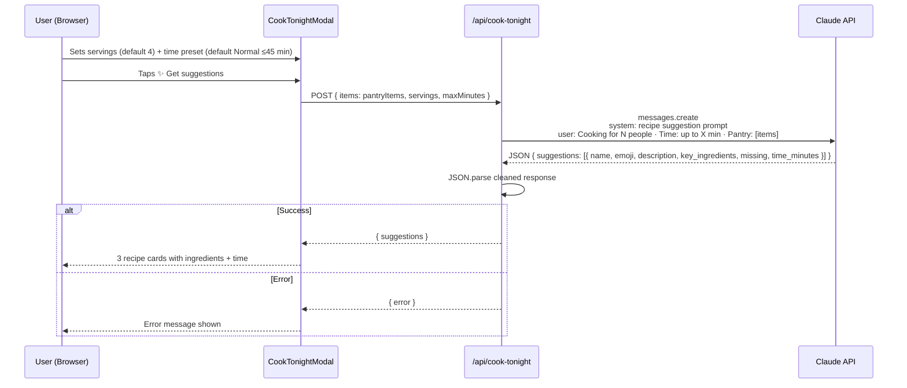

---

## 14. Role-Based Visibility

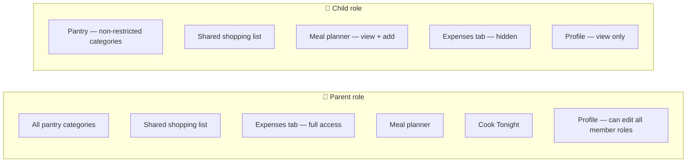
